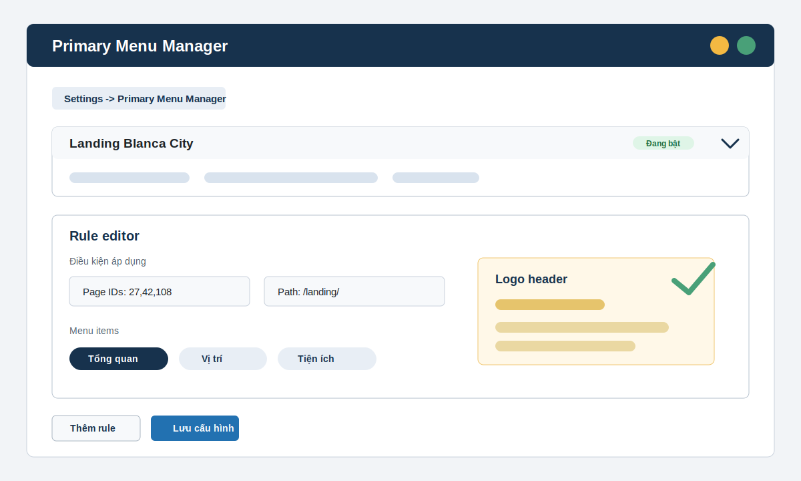

# Primary Menu Manager



Primary Menu Manager là plugin WordPress giúp thay danh sách item của primary menu theo từng landing page/page/post, kèm tùy chọn đổi logo và link logo trong header theo từng rule.

Plugin được viết theo hướng dễ mở rộng bằng vibe code: phần runtime có các hook rõ ràng để thêm điều kiện, đồng bộ rule từ nguồn khác, chỉnh menu object, hoặc can thiệp logo mà không phải sửa lại toàn bộ file chính.

## Thông tin

- Version: `1.2.0`
- Author: PDL Solutions (Phú Digital)
- Website: https://pdl.vn
- License: GPL-2.0-or-later
- Text domain: `primary-menu-manager`

## Plugin làm gì?

- Hook vào `wp_nav_menu_objects` để thay menu item khi rule khớp.
- Hỗ trợ nhiều `theme_location`, ví dụ `primary`, `slideout`, hoặc location riêng của theme.
- Rule có thể khớp theo ID page/post hoặc chuỗi trong URL path.
- Có thể đổi logo URL và link logo cho landing page đang khớp rule.
- Nếu không có rule nào khớp, WordPress/theme vẫn render menu và logo như mặc định.
- Rule có `priority` nhỏ hơn sẽ được kiểm tra trước.

## Cài đặt

Upload cả thư mục `primary-menu-manager` vào:

```text
wp-content/plugins/primary-menu-manager
```

Sau đó vào WordPress Admin và kích hoạt plugin.

## Cấu hình

Vào:

```text
Settings -> Primary Menu Manager
```

Tạo rule theo luồng sau:

1. Đặt tên rule để dễ quản lý.
2. Mở rule cần chỉnh, các rule còn lại sẽ tự thu gọn.
3. Chọn một hoặc nhiều menu location bằng các chip checkbox gọn trong cột thiết lập bên trái.
4. Nhập điều kiện áp dụng: tìm page/post theo tên hoặc ID để chọn, hoặc nhập URL path.
5. Thêm danh sách menu item riêng cho landing page ở cột bên phải, có thể kéo tay nắm để đổi thứ tự.
6. Nếu cần, bật đổi logo/link logo, duyệt logo từ Thư viện ảnh hoặc nhập URL tương ứng.
7. Dùng nút Sao chép trên rule khi muốn nhân bản menu; bản sao sẽ bỏ trống điều kiện hiển thị.
8. Lưu cấu hình.

URL menu item có thể là URL đầy đủ, đường dẫn tương đối như `/du-an/`, hoặc section ID như `#tong-quan`. Nếu để trống, plugin sẽ lưu là `#`.

## Kiến trúc mở rộng cho vibe code

File entrypoint chính là:

```text
primary-menu-manager.php
```

Các điểm mở rộng quan trọng:

| Hook | Dùng để làm gì |
| --- | --- |
| `pmm_rules` | Lọc hoặc inject danh sách rule trước khi runtime kiểm tra. |
| `pmm_sanitized_rule` | Bổ sung field tùy chỉnh khi lưu rule từ admin. |
| `pmm_rule_matches_current_request` | Thêm điều kiện khớp rule như taxonomy, user role, campaign param. |
| `pmm_matching_menu_rule` | Can thiệp rule thắng cuối cùng theo menu location. |
| `pmm_filtered_menu_items` | Sửa danh sách menu object sau khi plugin build xong. |
| `pmm_menu_item_object` | Sửa từng menu item object trước khi trả về theme. |
| `pmm_current_logo_config` | Can thiệp logo/link logo theo rule hoặc theo ngữ cảnh riêng. |

Ví dụ thêm điều kiện theo query string:

```php
add_filter( 'pmm_rule_matches_current_request', function ( $matches, $rule ) {
	if ( $matches ) {
		return true;
	}

	return isset( $_GET['campaign'] ) && 'summer' === sanitize_key( wp_unslash( $_GET['campaign'] ) );
}, 10, 2 );
```

Nguyên tắc mở rộng:

- Ưu tiên thêm hook hoặc helper nhỏ thay vì nhồi thêm logic vào admin UI.
- Giữ dữ liệu rule là array đơn giản để WordPress option dễ đọc/dễ migrate.
- Khi thêm điều kiện mới, luôn sanitize khi lưu và kiểm tra runtime bằng test nhỏ.
- Không thay đổi layout header/mobile menu trong plugin này; phần đó nên để theme xử lý.

## Kiểm thử nhanh

Chạy test logo/rule hiện có:

```bash
php tests/pmm-logo-rule-test.php
```

Kiểm tra cú pháp PHP:

```bash
php -l primary-menu-manager.php
```

## Đóng gói

Gói release nên có cấu trúc thư mục top-level:

```text
primary-menu-manager/
  primary-menu-manager.php
  README.md
  assets/
  tests/
```

File zip release chuẩn:

```text
dist/primary-menu-manager.zip
```

## Miễn trừ trách nhiệm

Plugin này được phát hành theo giấy phép nguồn mở GPL-2.0-or-later. Phần mềm được cung cấp theo hiện trạng, không kèm bất kỳ bảo đảm nào về tính phù hợp cho một mục đích cụ thể, khả năng vận hành liên tục, tương thích với mọi theme/plugin, hoặc không phát sinh lỗi trong mọi môi trường.

Người dùng chịu trách nhiệm kiểm thử trên staging/backup trước khi dùng cho website production. PDL Solutions (Phú Digital) không chịu trách nhiệm cho mất dữ liệu, gián đoạn dịch vụ, xung đột plugin/theme, hoặc thiệt hại phát sinh từ việc cài đặt, chỉnh sửa, phân phối lại, hoặc sử dụng plugin này.
